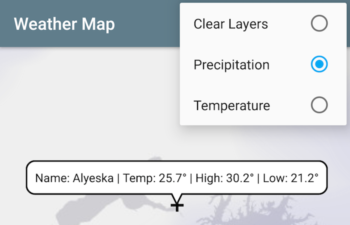

# Weather Map
A simple Kotlin Android app integrating OpenWeatherMap and ArcGIS Runtime Android API's.



## Dependencies
- [Kotlin Anko](https://github.com/Kotlin/anko)
- [ArcGIS Android](https://developers.arcgis.com/android/)
- [Open Weather Map](https://openweathermap.org/)
- [Retrofit](http://square.github.io/retrofit/)

## ArcGIS Runtime SDK for Android
This app is explicitly intended for developement and testing, you can become a member of the [ArcGIS Developer Program](https://developers.arcgis.com/pricing/) for free, more details about licensing your ArcGIS Runtime app can be found [here](https://developers.arcgis.com/arcgis-runtime/licensing/). 

## Open Weather Map
To access the OpenWeatherMap API you need an [API Key](http://openweathermap.org/appid).  To use your API Key, create a **gradle.properties** file in the root of the **app** module with a string value pair representing your API Key.  This file is not tracked in Git as it is for personal use.

```groovy
API_KEY = "YOUR-API-KEY"
```

## Licensing
A copy of the license is available in the repository's [LICENSE](LICENSE) file.
