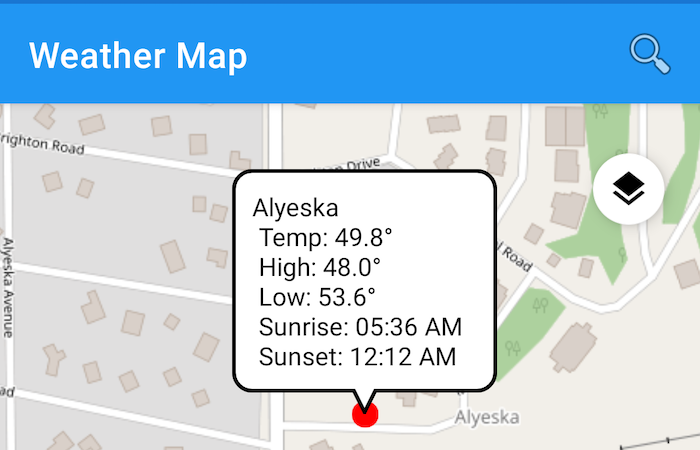

# Weather Map
[](https://travis-ci.org/doneill/weather-map)

An Android app integrating OpenWeatherMap, Google Places API, and ArcGIS Runtime Android APIs using the [Kotlin](https://kotlinlang.org/) programming language.



## Dependencies
- [Kotlin Anko](https://github.com/Kotlin/anko)
- [Kotlin Coroutines](https://kotlinlang.org/docs/reference/coroutines-overview.html)
- [ArcGIS Android](https://developers.arcgis.com/android/)
- [Google Places API](https://developers.google.com/places/web-service/intro)
- [Open Weather Map](https://openweathermap.org/)
- [Retrofit](http://square.github.io/retrofit/)

## ArcGIS Runtime SDK for Android
This app is explicitly intended for development and testing, you can become a member of the [ArcGIS Developer Program](https://developers.arcgis.com/pricing/) for free, more details about licensing your ArcGIS Runtime app can be found [here](https://developers.arcgis.com/arcgis-runtime/licensing/).

## Open Weather Map
To access the OpenWeatherMap API you need an [API Key](http://openweathermap.org/appid).  To use your API Key, create a **gradle.properties** file in the root of the **app** module with a string value pair representing your API Key.  This file is not tracked in Git as it is for personal use.

```groovy
API_KEY = "YOUR-API-KEY"
```

## Google Places API
This app supports autocomplete service in the Google Places API, you must register this app project in your Google API Console and get a Google API key to add to the app. Refer to [Google](https://developers.google.com/places/web-service/get-api-key) about signing up and getting your API keys.  Once you have your key, add it to the **gradle.properties** file created in the section above and append the key as follows:

```groovy
...
PLACES_API_KEY = "YOUR-API-KEY"
```

## Contributors
<a href="https://github.com/doneill/weather-map/graphs/contributors">
  
</a>

## Licensing
A copy of the license is available in the repository's [LICENSE](LICENSE) file.
