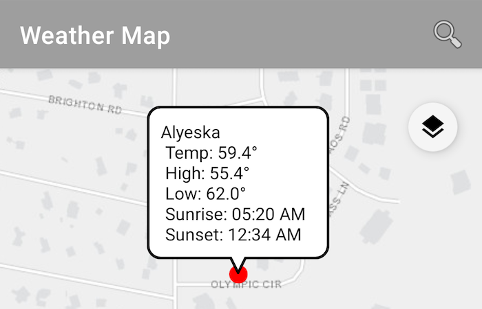

# Weather Map

[comment]: <> ([![Build Status]&#40;https://travis-ci.org/doneill/weather-map.svg?branch=master&#41;]&#40;https://travis-ci.org/doneill/weather-map&#41; [![Quality Gate Status]&#40;https://sonarcloud.io/api/project_badges/measure?project=doneill_weather-map&metric=alert_status&#41;]&#40;https://sonarcloud.io/dashboard?id=doneill_weather-map&#41;)

An Android app integrating OpenWeatherMap, Google Places API, and ArcGIS Runtime Android SDK using [Kotlin](https://kotlinlang.org/).



## Dependencies
- [Kotlin Anko](https://github.com/Kotlin/anko)
- [Kotlin Coroutines](https://kotlinlang.org/docs/reference/coroutines-overview.html)
- [ArcGIS Android](https://developers.arcgis.com/android/)
- [Google Places API](https://developers.google.com/places/web-service/intro)
- [Open Weather Map](https://openweathermap.org/)
- [Retrofit](http://square.github.io/retrofit/)

## API Keys
This app uses 3 developer products that requiring API keys to enable its full capabilities:  

- [ArcGIS Runtime](https://developers.arcgis.com/documentation/mapping-apis-and-services/security/#api-keys): The mapping engine and coordinate conversion tool
- [OpenWeather API](https://openweathermap.org/appid): Current weather for location by coordinate or place name
- [Google Places API](https://developers.google.com/maps/documentation/places/web-service/get-api-key): Search for places with detailed information and autocomplete when user types in search box

Once you have registered the app and received your API keys you can use them by creating a **gradle.properties** file in the root of the **app** module with a string value pair representing your API Keys. This file is not tracked in Git to keep personal API keys secret.

```bash
API_KEY = "YOUR-OPEN-WEATHER-API-KEY"
PLACES_API_KEY = "YOUR-GOOGLE-PLACES-API-KEY"
ARCGIS_KEY = "YOUR-ARCGIS-RUNTIME-API-KEY"
```

## Contributors
<a href="https://github.com/doneill/weather-map/graphs/contributors">
  
</a>

## Licensing
A copy of the license is available in the repository's [LICENSE](LICENSE) file.
